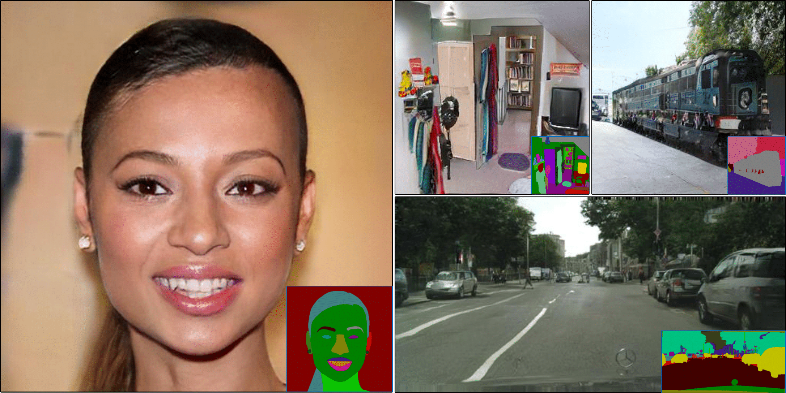
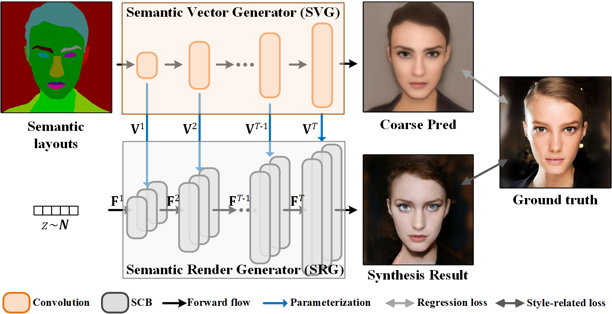
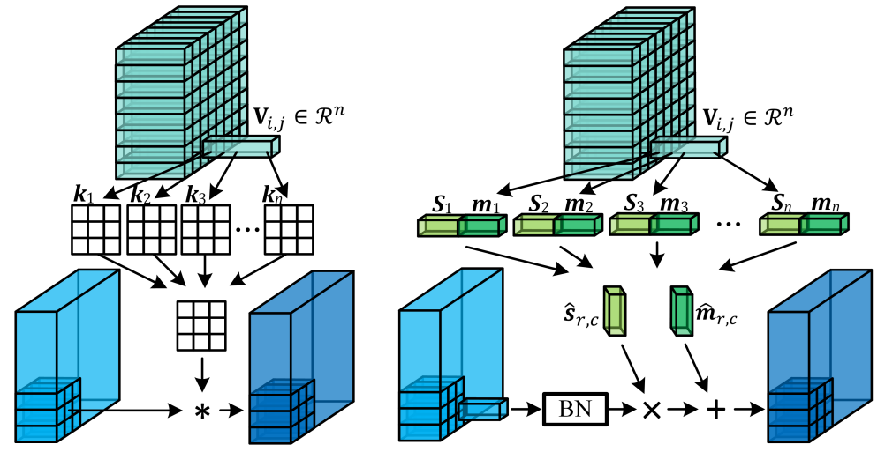

# Image synthesis via semantic synthesis [[Project Page](https://shepnerd.github.io/scg/)]
by [Yi Wang](https://shepnerd.github.io/), [Lu Qi](http://luqi.info), [Ying-Cong Chen](https://www.yingcong.me), [Xiangyu Zhang](), [Jiaya Jia](https://jiaya.me).

## Introduction
This repository gives the implementation of our semantic image synthesis method in ICCV 2021 paper, '[Image synthesis via semantic synthesis]()'.



## Our framework



## Usage

```bash
git clone https://github.com/dvlab-research/SCGAN.git
cd SCGAN/code
```

To use this code, please install PyTorch 1.0 and Python 3+. Other dependencies can be installed by
```bash
pip install -r requirements.txt
```

### Dataset Preparation
Please refer to [SPADE](https://github.com/NVlabs/SPADE) for detailed execution.

### Testing
1. Downloading pretrained models, then putting the folder containing model weights in the folder `./checkpoints`.

2. Producing images with the pretrained models.
```bash
python test.py --gpu_ids 0,1,2,3 --dataset_mode [dataset] --config config/scgan_[dataset]_test.yml --fid --gt [gt_path] --visual_n 1
```
For example,
```bash
python test.py --gpu_ids 0,1,2,3 --dataset_mode celeba --config config/scgan_celeba-test.yml --fid --gt /data/datasets/celeba --visual_n 1
```

3. Visual results are stored at `./results/scgan_[dataset]/` by default.

#### Pretrained Models (to be updated)
|Dataset       |Download link     |
|:-------------|:-----------------|
|CelebAMask-HQ|[Baidu Disk](https://pan.baidu.com/s/1__AtIALtbv0H5IDAB8_sjA) (Code: face)|
|ADE20K|[Baidu Disk](https://pan.baidu.com/s/1F64NK8Kgz4zpl8ETjTVekA) (Code: n021) or [Onedrive](https://pjlab-my.sharepoint.cn/:u:/g/personal/wangyi_pjlab_org_cn/EboHJ-o3CBhFtGxbzPCGZA0BQ6siKfhIEJZu_ao9NFwuVg?e=RZZsCl)\| [Visual results](https://pan.baidu.com/s/1d-DkHen9MUp5AgWJKxCVJA) (Code: wu7b) or [Onedrive](https://pjlab-my.sharepoint.cn/:u:/g/personal/wangyi_pjlab_org_cn/Ed5XJuzkAbNIi1yqhRF8rfQBNWFlDfiKYebOyecwofOt2g?e=ub49Nd)|
|COCO|[Baidu Disk](https://pan.baidu.com/s/1vRLRy3wsfoYH9GqjQuxV3Q) (Code: ss4b)\| [Visual results](https://pan.baidu.com/s/10dScbMEMxfCPpcW0ywsbMg) (Code: i4dw)|

### Training
Using `train.sh` to train new models. Or you can specify training options in `config/[config_file].yml`.

## Key operators
Our proposed dynamic computation units (spatial conditional convolution and normalization) are extended from conditionally parameterized convolutions [1]. We generalize the scalar condition into a spatial one and also apply these techniques to normalization.



### Citation

If our research is useful for you, please consider citing:

    @inproceedings{wang2021image,
      title={Image Synthesis via Semantic Composition},
      author={Wang, Yi and Qi, Lu and Chen, Ying-Cong and Zhang, Xiangyu and Jia, Jiaya},
      booktitle={ICCV},
      year={2021}
    }

## Acknowledgements
This code is built upon [SPADE](https://github.com/NVlabs/SPADE), [Imaginaire](https://github.com/NVlabs/imaginaire), and [PyTorch-FID](https://github.com/mseitzer/pytorch-fid).

### Reference
```
[1] Brandon Yang, Gabriel Bender, Quoc V Le, and Jiquan Ngiam. Condconv: Conditionally parameterized convolutions for efficient inference. In NeurIPS. 2019.
```

### Contact

Please send email to yiwang@cse.cuhk.edu.hk.
